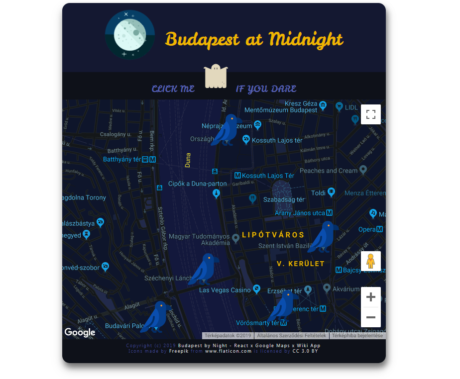

# Google Maps x React x Wiki Neighbourhood App

[](http://nyafologus.github.io/reactnd-neighbourhood/ "Budapest at Midnight")

## Description
>This is the 8th and final project for the Udacity [Front-End Web Dev Nanodegree](https://udacity.com/course/front-end-web-developer-nanodegree--nd001/ "Front-End Web Developer Nanodegree") and part of the [React Fundamentals Nanodegree](https://www.udacity.com/course/react-nanodegree--nd019/ "React Developer Nanodegree") course.

This single page application was built from scratch using ReactJS, and features data using [Google Maps](https://cloud.google.com/maps-platform/ "Google Maps API") Javascript API, as well as [Wikipedia](https://www.mediawiki.org/wiki/API:Main_page "Wikipedia API") 3rd party API.

## Installation and Launch Instructions

  - Copy/clone repository from Github using Git:
```sh
$ git clone git@github.com:nyafologus/reactnd-neighbourhood.git
``` 
  - (or download it from [here](https://github.com/nyafologus/reactnd-neighbourhood/archive/master.zip "Download ZIP").)

  - Navigate into project directory

  - Install dependencies with ```npm install``` or ```yarn install```

  - Start app server with ```npm start```
  
  - Visit http://localhost:3000

## Dependencies

This project was initialized by [Create React App](https://github.com/facebookincubator/create-react-app). More information on how to perform common tasks can be found [here](https://github.com/facebookincubator/create-react-app/blob/master/packages/react-scripts/template/README.md "Facebook Incubator").

## Note on Service Worker

Full service worker functionality has been provided in developer mode (result of being bootstrapped with Create React App). 
To see offline functionality in action though, the App needs to be built in production mode:

- Build app server with ```npm run build``` and then ```serve -s build```
- Visit  http://localhost:5000